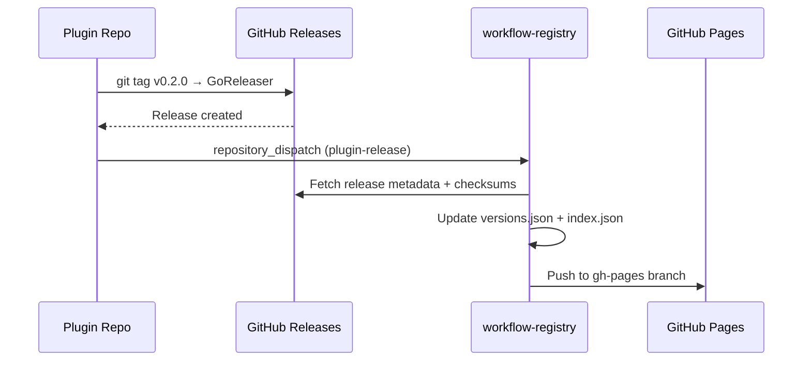

# Plugin Ecosystem Design

**Goal:** End-to-end plugin lifecycle — create, test, register, download, verify, install, and use plugins — for both plugin authors and consumers, with IDE marketplace integration.

**Architecture:** Hybrid static registry (GitHub Pages + repository_dispatch) with tiered trust model (cosign for official/verified, checksum for community), opt-in engine auto-fetch, and IDE marketplace panels.

**Tech Stack:** Go (wfctl + engine), GitHub Actions, GitHub Pages, GoReleaser, cosign, static JSON

---

## 1. Registry Architecture

### Static Registry on GitHub Pages

The public registry (`workflow-registry`) serves static JSON via GitHub Pages at `https://gocodealone.github.io/workflow-registry/v1/`.

**URL structure:**
```
/v1/index.json                        # Full catalog
/v1/plugins/<name>/manifest.json      # Plugin manifest (from repo)
/v1/plugins/<name>/versions.json      # All known versions + download URLs + checksums
/v1/plugins/<name>/latest.json        # Latest version shortcut
```

### Version Tracking

Plugin repos notify the registry on new releases via `repository_dispatch`:



Fallback: daily cron Action polls all registered plugins for missed releases.

### `versions.json` Format

```json
{
  "name": "workflow-plugin-datadog",
  "versions": [
    {
      "version": "v0.1.0",
      "released": "2026-03-10T12:00:00Z",
      "minEngineVersion": "0.3.30",
      "downloads": [
        {
          "os": "linux",
          "arch": "amd64",
          "url": "https://github.com/GoCodeAlone/workflow-plugin-datadog/releases/download/v0.1.0/workflow-plugin-datadog-linux-amd64.tar.gz",
          "sha256": "abc123..."
        }
      ],
      "signature": null
    }
  ]
}
```

### Private Registries

- **workflow-cloud-registry** (existing) holds commercial private plugins (e.g., cloud-ui)
- Commercial plugins use download URLs that point to a workflow-cloud API endpoint requiring subscription token authentication
- Self-hosted private plugins: install directly via `wfctl plugin install --url <release-url>` or `--local <path>` — no registry needed

### Registry Configuration

```yaml
# ~/.config/wfctl/config.yaml
registries:
  public:
    url: https://gocodealone.github.io/workflow-registry/v1
  cloud:
    url: https://api.workflow-cloud.com/registry/v1
    token: wfc_abc123...
```

The `public` registry is always configured by default. Additional registries are optional.

---

## 2. Plugin Author Experience

### Scaffolding

`wfctl plugin init my-plugin` generates a complete plugin project:

```
workflow-plugin-my-plugin/
├── cmd/workflow-plugin-my-plugin/main.go    # gRPC entrypoint
├── internal/
│   ├── provider.go                          # PluginProvider + ModuleProvider + StepProvider stubs
│   └── steps.go                             # Example step implementation
├── plugin.json                              # Manifest
├── go.mod
├── .goreleaser.yml                          # Cross-platform build config
├── .github/workflows/
│   ├── ci.yml                               # Test + lint on PR
│   └── release.yml                          # GoReleaser + notify-registry dispatch
├── Makefile                                 # build, test, install-local
└── README.md
```

The `release.yml` includes the registry notification job:

```yaml
notify-registry:
  if: startsWith(github.ref, 'refs/tags/v')
  needs: [release]
  runs-on: ubuntu-latest
  steps:
    - uses: peter-evans/repository-dispatch@v3
      with:
        token: ${{ secrets.REGISTRY_PAT }}
        repository: GoCodeAlone/workflow-registry
        event-type: plugin-release
        client-payload: '{"plugin": "${{ github.repository }}", "tag": "${{ github.ref_name }}"}'
```

### Local Testing

```bash
wfctl plugin test                 # go test ./... + manifest validation
wfctl plugin install --local .    # Install from local build to data/plugins/
```

### Publishing to Public Registry

Third-party authors:
1. Fork `workflow-registry`
2. Add `plugins/<name>/manifest.json` (conforming to schema)
3. Open PR — CI validates manifest schema + checks GitHub repo exists
4. Maintainer reviews and merges
5. Registry Action auto-populates `versions.json` from plugin's GitHub Releases

### Author Documentation

A `docs/PLUGIN_AUTHORING.md` guide covering the full flow: init → develop → test → publish → register.

---

## 3. Consumer Experience

### Discovery

```bash
wfctl plugin search datadog          # Searches registry index by name/description
wfctl plugin search --tag monitoring # Filter by keyword tags
wfctl plugin info datadog            # Full details: description, versions, steps, modules
```

### Installation

```bash
wfctl plugin install datadog                  # Latest from public registry
wfctl plugin install datadog@v0.2.0           # Specific version
wfctl plugin install --registry cloud cloud-ui # From private registry
wfctl plugin install --url <release-url>       # Direct URL (no registry)
wfctl plugin install --local ./path            # Local build
```

Install flow:
1. Fetch `versions.json` from registry
2. Find matching version + OS/arch binary
3. Download `.tar.gz` from GitHub Releases URL
4. Verify SHA-256 checksum (from `versions.json`)
5. For official/verified tier: verify cosign signature
6. Extract to `data/plugins/<name>/`
7. Update `.wfctl.yaml` lockfile

### Lockfile

```yaml
# .wfctl.yaml
plugins:
  workflow-plugin-datadog:
    version: v0.1.0
    sha256: abc123...
    registry: public
  workflow-plugin-cloud-ui:
    version: v0.1.0
    sha256: def456...
    registry: cloud
```

Extends existing lockfile (`cmd/wfctl/plugin_lockfile.go`) with `registry` field and checksum verification on load.

### Updating

```bash
wfctl plugin update              # Update all to latest compatible versions
wfctl plugin update datadog      # Update specific plugin
```

---

## 4. Engine Auto-Fetch

Opt-in per plugin in workflow config:

```yaml
plugins:
  external:
    - name: workflow-plugin-datadog
      autoFetch: true              # Fetch from registry if not on disk
      version: ">=0.1.0"           # Version constraint (semver)
    - name: workflow-plugin-custom
      autoFetch: false             # Manual install only (default)
```

On engine startup, if a declared plugin is missing and `autoFetch: true`:
1. Query registry for latest version matching constraint
2. Download, verify checksum, extract (same flow as `wfctl plugin install`)
3. Load plugin normally
4. Update lockfile

Auto-fetch respects the lockfile — if a pinned version exists, use that exact version.

---

## 5. IDE Integration

### Marketplace Panel

Both VS Code and JetBrains extensions gain a "Plugin Marketplace" panel:
- Fetches `index.json` from the public registry
- Browsable/searchable list of available plugins
- Each plugin shows: name, description, tier badge, version, step count
- "Install" button runs `wfctl plugin install <name>` via terminal
- Installed plugins show checkmark + "Update" button when newer version available

### Schema Integration

1. User installs plugin via marketplace or `wfctl`
2. Plugin's `plugin.json` declares step types + module types
3. Editor's `loadPluginSchemas()` picks up manifest from `data/plugins/<name>/plugin.json`
4. New step/module types appear in node palette immediately

No changes needed to `@gocodealone/workflow-editor` — it already supports `loadPluginSchemas()`.

---

## 6. Trust Model (Tiered)

| Tier | Verification | Badge | Who |
|------|-------------|-------|-----|
| **official** | Cosign signature + SHA-256 | "Official" | GoCodeAlone-maintained plugins |
| **verified** | Cosign signature + SHA-256 | "Verified" | Reviewed third-party plugins with signed releases |
| **community** | SHA-256 checksum only | "Community" | Any plugin author, PR-reviewed manifests |

### Verification on Install

1. Download binary + fetch checksum from `versions.json`
2. Verify SHA-256 matches
3. If tier is `official` or `verified`: fetch cosign signature, verify against known public key
4. If verification fails: abort install, show error

### Verification on Engine Load

1. Read lockfile checksum for the plugin
2. Hash on-disk binary
3. If mismatch: refuse to load, log error (prevents post-install tampering)

### Signing for Authors

- **Official plugins:** CI signs with GoCodeAlone cosign key (GitHub secret)
- **Verified plugins:** Author signs with their own cosign key, public key registered in manifest
- **Community plugins:** No signing required, just GoReleaser checksums

---

## 7. Implementation Scope

### Registry Infrastructure
- GitHub Pages setup for `workflow-registry`
- GitHub Action: `build-index.yml` (generates static JSON from manifests + GitHub Releases)
- GitHub Action: `on-plugin-release.yml` (handles `repository_dispatch`)
- Schema validation Action for PR'd manifests
- Daily cron fallback for missed dispatches

### wfctl Enhancements
- `plugin init` scaffold with complete project template
- `plugin install --url` for direct URL installs
- Registry config in `~/.config/wfctl/config.yaml`
- Checksum verification on install + engine load
- Cosign verification for official/verified tier
- `plugin update` command
- Auto-fetch support in engine plugin loader

### IDE Extensions
- Marketplace panel (VS Code + JetBrains)
- Install/update buttons triggering `wfctl` commands
- Registry fetch with caching

### Documentation
- `docs/PLUGIN_AUTHORING.md` — full author guide
- `docs/PLUGIN_REGISTRY.md` — registry structure, PR process, version tracking
- Registry README update with contribution guidelines
